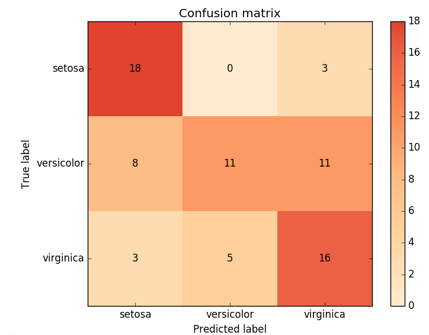

#sklearn-evaluation

[](https://travis-ci.org/edublancas/sklearn-evaluation)

Utilities for making scikit-learn evaluation much easier.

**Note: this project is in a very early stage of development.**

I'm using this for my personal projects. The plots and tables module are well-tested, but still try it at your own risk.

#Install

```bash
pip install sklearn-evaluation
```

#Usage

The package is divided in modules that have specific functionality.

##Plots module

Generate evaluation plots with a single function call.
```python
from sklearn_evaluation import plots

#code for data loading and model training

plots.confusion_matrix_(y_true, y_pred, target_names=target_names)
```



See this Jupyter [notebook](examples/plots.ipynb) for more examples.

##Tables module

Generate good looking tables from your model easily.

```python
from sklearn_evaluation import tables

#code for data loading and training

tables.feature_importances(model, feature_list)
```

```
+-----------+--------------+-----------+
| name      |   importance |       std |
+===========+==============+===========+
| Feature 0 |    0.250398  | 0.0530907 |
+-----------+--------------+-----------+
| Feature 1 |    0.232397  | 0.0523836 |
+-----------+--------------+-----------+
| Feature 2 |    0.148898  | 0.0331814 |
+-----------+--------------+-----------+
| Feature 3 |    0.0553634 | 0.0128296 |
+-----------+--------------+-----------+
| Feature 8 |    0.05401   | 0.0122248 |
+-----------+--------------+-----------+
| Feature 5 |    0.053878  | 0.01289   |
+-----------+--------------+-----------+
| Feature 6 |    0.0525828 | 0.0130225 |
+-----------+--------------+-----------+
| Feature 9 |    0.0510197 | 0.0129436 |
+-----------+--------------+-----------+
| Feature 7 |    0.0509633 | 0.0117197 |
+-----------+--------------+-----------+
| Feature 4 |    0.0504887 | 0.012844  |
+-----------+--------------+-----------+
```

Also, running this in Jupyter will generate a pandas-like output. See [notebook](examples/plots.ipynb)

##Report generation module

Generate HTML reports in one line.

```python
from sklearn_evaluation.report import ReportGenerator

#code for data loading and model training

#Instantiate ReportGenerator with a path to save the HTML files
rg = ReportGenerator(savepath='~/my-awesome-models')
#Generate report
rg.generate_report(model=forest, y_true=y_true, y_pred=y_pred, y_score=y_score, feature_list=feature_list, target_names=target_names, name=name)
```

The code above will generate a report [like this.](http://htmlpreview.github.com/?https://github.com/edublancas/sklearn-model-evaluation/blob/master/examples/sample_report.html)

Reports are self-contained, all images are included in the html file using [base64](https://en.wikipedia.org/wiki/Base64).
